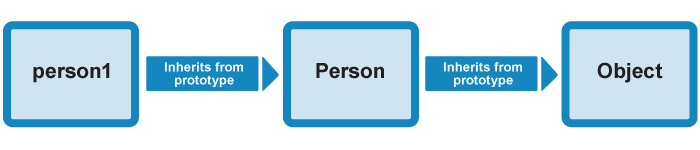

# OOP trong Js
1. Ôn lại kiến thức

* JavaScript type có thể chia thành 2 loại sau: kiểu dữ liệu nguyên thủy và kiểu dữ liệu object
    * kiểu dữ liệu nguyên thủy bao gồm: `number`, `string`, `boolean`, `null` ,`underfined`.
    * kiểu dữ liệu object(trong Js hầu như mọi thứ đều có thể là object):
        * `Booleans` có thể là object nếu được khai báo với từ khóa `new`.
        * `Numbers` có thể là object nếu được khai báo với từ khóa `new`.
        * `Strings` có thể là object nếu được khai báo với từ khóa `new`.
        * `Dates`, `Maths`, `Regular expressions (Regex)`, `Arrays`, `Functions`, `Objects` luôn luôn là object.

* Thuộc tính (Property) và phương thức (method) trong object:
    * Thuộc tính là những key chứa value mà ta khai báo bên trong object để sử dụng trong chương trình, `property trong object luôn là string`, value của property có thể là `kiểu dữ liệu nguyên thủy` hoặc là `1 object`, khi nó là `function` thì ta gọi property đó là `method`.
    * Method hiểu đơn gian là những hành động mà bạn muốn chương trình thực hiện tương ứng với object đó.
```javascript
    var person = {
        firstName:"John", 
        lastName:"Doe", 
        age:50, 
        famous: false,
        family: {
            wife: 'Sally Rally',
            son: 'Pi',
            daughte: 'Mary'
        },
        getInfo: function () {
            return `This is ${this.firstName} ${this.lastName}`
        }    
    }
```

* Có 3 cách tạo new object:
    * Sử dụng object Literal.
    * Sử dụng từ khóa `new`.
    * Sử dụng object constructor.

#### Sử dụng object Literal
* Đây là cách đơn giản nhất để tạo ra 1 object, bạn chỉ phải khai báo và định nghĩa object trong 1 câu lệnh:
```javascript
   var person = {firstName:"John", lastName:"Doe", age:50, eyeColor:"blue"}
```

#### Sử dụng từ khóa `new` :
* Bạn chỉ cần sử dụng cú pháp sau `new` :
```javascript
    var person = new Object();
    person.firstName = "John";
    person.lastName = "Doe";
    person.age = 50;
    person.eyeColor = "blue";
    console.log(person) // { firstName: 'John', lastName: 'Doe', age: 50, eyeColor: 'blue' }
```
* Tuy nhiên cách này không được khuyến cáo vì nó khiến code của bạn nhìn rối hơn, tốc độ xử lý chậm hơn, khó kiểm soát hơn dẫn đến những lỗi không mong muốn.

#### Sử dụng object constructor:
* 2 cách trên sẽ có giới hạn trong nhiều trường hợp vì chúng chỉ tạo ra single object. Giả sử bạn muốn tạo các object mà có những property và method giống, bạn sẽ phải tạo ra nhiều single object giống như bên trên, sẽ rất mất công. Thay vào đó ta sử dụng object constructor, chỉ cần định nghĩa 1 lần mà có thể dùng cho nhiều trường hợp:
```javascript
    function person(first, last, age, eye) {
    this.firstName = first;
    this.lastName = last;
    this.age = age;
    this.eyeColor = eye;
    }
    var myFather = new person("John", "Doe", 50, "blue");
    var myMother = new person("Sally", "Rally", 48, "green");

    console.log(myFather) // person { firstName: 'John', lastName: 'Doe', age: 50, eyeColor: 'blue' }
    console.log(myMother) // person { firstName: 'Sally', lastName: 'Rally', age: 48, eyeColor: 'green' }
```
* Từ khóa `this`:
    * Là từ khóa rất quan trọng và thường được dùng trong javascript nói chung cũng như trong lập trình hướng đối tượng nói riêng, `this` như tên gọi nó sẽ trỏ tới `cái này` chính là đối tượng hiện tại trong phạm vi truy vấn (scoping) bao quanh nó. Xem qua ví dụ sau:

```javascript
    let animalNo1 = {
        type: 'Cat',
        cry() {
            return `${animalNo1.type} cries Meow Meow`
        }
    }
    console.log(animalNo1.cry()) // Cat cries Meow Meow
```
```javascript
    let animalNo2 = {
        type: 'Dog',
        cry() {
            return `${this.type} cries Gaoo Gaoo`
        }
    }
    console.log(animalNo2.cry()) // Dog cries Gaoo Gaoo
```
* Nhìn 2 ví dụ trên bạn sẽ thấy mình để method cry() của animalNo1 là `animalNo1` trong khi animalNo2 là `this` mà nó vẫn chạy đúng thay vì mỗi lần tạo một thực thể animal mới mà phải gõ kiểu truy vấn `obj->property` thì ta chỉ cần dùng this vào là xong

```javascript
    let cat = {
        name: 'Tom',
        spacies: 'Russian Blue',
        intro(){
            return `${this.name} is a ${this.spacies} cat`
        }// ở đây this sẽ trỏ tới đối tượng cat tương ứng cat.name,cat.spacies
    }
    // Tom là một chú mèo Nga lông xanh
    console.log(cat.intro()) // in ra 'Tom is a Russian Blue cat'
```

* Built-in JavaScript Constructors for native objects :
```javascript
    var obj = new Object()    // A new Object object
    var str = new String()    // A new String object
    var num = new Number()    // A new Number object
    var boolean = new Boolean()   // A new Boolean object
    var arr = new Array()     // A new Array object
    var regex = new RegExp()    // A new RegExp object
    var func = new Function()  // A new Function object
    var date = new Date()     // A new Date object
```

* Math() object là global object vì thế không thể dùng với từ khóa new.
* Vì lí do bên trên bạn nên chúng ta nên tránh tuyệt đối kiểu khai báo dạng object, thay vào đó, ta sẽ khai báo kiểu loose typing như sau:

```javascript
    var object = { } // object
    var string = '' // chuỗi
    var number = 1312 // số
    var boolen = true //  boolean
    var arr = [ ] // mảng
```
2. Đối Tượng Trong Lập Trình Hướng Đối Tượng

### Định nghĩa về đối tượng trong Lập trình hướng đối tượng:
* Đối tượng là gì ?, đối tượng là một thực thể có trạng thái và hành vi, Như con mèo là một thực thể loài vật có trạng thái là lông vàng,đen,trắng,.. mắt xanh, mắt đỏ,... có hành vì là bắt chuột, kêu meo meo, thích vuốt ve,... và con mèo là một thực thẻ loài vật trong (kế thừa) Thế giới động vật.

* Đối tượng trong javascript cũng tương tự như vậy, một đối tượng có trạng thái là các thuộc tính (property) và hành vi là các phương thức (method) và là thực thể (instance) kế thừa từ nguyên mẫu (prototype) Object (chú ý chữ O viết hoa và thường).

```javascript
    let cat = {
        // trạng thái
        name: 'Tom',                // thuộc tính
        spacies: 'Russian Blue',    // thuộc tính
        sound: 'meow meow',         // thuộc tính

        // hành vi
        cry() {                     // phương thức
            return `${this.name} cries ${this.sound} ${this.sound}`
        }
    }
    // log ra đối tượng cat:
    console.log(cat) // in ra cat {name: 'Tom', spacies: 'Russian Blue',...}

    // kiểm tra kế thừa với instanceof 
    console.log(cat instanceof Object) // in ra true 
    // tức đối tượng 'cat' là kế thừa của nguyên mẫu Object
```
* Đối tượng trong javascript được chia làm hai loại, đó là kiểu đối tượng định nghĩa sẵn và kiểu đối tượng "Nhân tạo" được tạo bởi lập trình viên(là chúng ta). Kiểu đối tượng định nghĩa sẵn rất quan trọng, nó là tiền đề để ta tạo ra kiểu đối tượng còn lại, bài này sẽ đi sâu vào kiểu "Nhân tạo" khi ta "hướng đối tượng nó".

* Ví dụ cho kiểu đối tượng định nghĩa sẵn: chính là các kiểu dữ liệu rất quen thuộc như: mảng(Array), boolean(Boolean - true,false), ngày tháng(Date), số(Number), hàm toán học(Math), biểu thức tìm kiếm (RegExp), hàm (Function), chuỗi (String) và cuối cùng là đối tượng (Object).

```javascript
    var person = { }
    person.firstName = "John"
    person.lastName = "Doe"
    person.age = 5
    person.eyeColor = "blue"
    console.log(person) // { firstName: 'John', lastName: 'Doe', age: 50, eyeColor: 'blue' }
```
* Từ kiểu Object định nghĩa sẵn là person = {}, bạn có thể tạo ra 1 object nhân tạo với các thuộc tính theo ý của mình.
* Bạn nên chúng ta nên tránh tuyệt đối kiểu khai báo dạng object, thay vào đó bạn nên khai báo kiểu loose typing giống bên trên.

* Sử dụng các hàm khởi tạo, ta sẽ tạo được các đối tượng "Nhân tạo" với các Thuộc tính `(properties)` và Phương thức `(method)` tùy theo ý người code, dù vậy, các đối tượng "Nhân tạo" vẫn là các thực thể `(instance)` được kế thừa `(inherit)` các thuộc tính và phương thức của nguyên mẫu `(prototype)` của chúng và hoàn toàn có thể truy vẫn `properties` và `method` của `Object.prototype`.

```javascript
    let cat = {// đây là các thuộc tính
        name: 'Tom',                // tên là Tom    
        spacies: 'Russian Blue',    // loài mèo Nga lông xanh
        cry(){                      // Tom kêu meo meo
            return `${this.name} cries Meow Meow`
        } // đây là một method (phương thức) dưới dạng hàm
    }
```
* Do đối tượng 'cat' ở ví dụ trên là một instance (thực thể) của prototype (nguyên mẫu) Object nên 'cat' sẽ kế thừa các method (phương thức) của đối tượng định nghĩa sẵn Object.
    * Xem thêm về Object.prototype [tại đây](https://developer.mozilla.org/vi/docs/Web/JavaScript/Reference/Global_Objects/Object/prototype)

```javascript
    console.log(Object.keys(cat).length) 
    //in ra 3 là số lượng thuộc tính và phương thức của đối tượng

    console.log(cat.toString()) 
    // in ra [object Object] dù ta chưa khai báo method toString() cho cat,nó được kế thừa từ Object.
```    

###  Constructor - Hàm khởi tạo và Encapsulation - Tính đóng gói.

#### Constructor và This
* Constructor
    * Nói một cách dễ hiểu thì giả sử ta có một đối tượng là thế giới động vật, tuy nhiên nói thế giới động vật không thì rất chung chung (không nên nói con mèo, con chó, con cáo chung chung là đồ con vật) mà ta sẽ chia nhỏ TGĐV ra làm nhiều phân loài như thú nuôi, thú hoang,.. các phân loài vừa kể trên sẽ được đóng gói gọn trong đối tượng thế giới động vật và chính các phân loài đó lại đóng gói các chi loài nhỏ hơn và cứ thế tiếp tục... Công việc đó gọi là đóng gói (Encapsulation) và cái cách mỗi con vật được khai báo trong phân loài ta gọi là Phương thức khởi tạo thực thể (Constructor). Sau đây là ví dụ:

```javascript
    // ví dụ về khởi tạo đối tượng một cách "chung chung"
    let animalNo1 = {
        type: 'Cat',
        cry() {
            return `${this.type} cries Meow Meow`
        }
    }

    let animalNo2 = {
        type: 'Dog',
        cry() {
            return `${this.type} cries Gaoo Gaoo`
        }
    }

    let Animal = {animalNo1,animalNo2}

    // Truy vấn tới cat và dog:
    console.log(Animal.animalNo1)    // in ra { type: 'Cat', cry: [Function: cry] }
    console.log(Animal.animalNo2)    // in ra { type: 'Dog', cry: [Function: cry] }
```    
* Ở ví dụ trên, nếu ta muốn thêm thú nuôi vào thì ta lại phải khai báo thú mới một cách rất thủ công, và khó kiểm soát nếu 'Animal' càng ngày càng lớn, hay thêm một ngàn con vật kêu khác nhau rồi ta sửa method cry ngàn lần ?, không, ta sẽ làm cách máy móc nhưng dễ kiểm soát hơn là dùng Phương thức Khởi tạo (Constructor):
```javascript
    // Phương thức khởi tạo cho đối tượng Animal
    function Animal(type,sound){
        this.type = type
        this.sound = sound
        this.cry = function(){
            return `${this.type} cries ${this.sound} ${this.sound}`
        }
    }

    // Thực thể hóa (instantiation) các thực thể cat và dog
    let animalNo1 = new Animal('Cat','Meow') // log in ra { type: 'Cat', cry: [Function: cry] }                                  
    let animalNo2 = new Animal('Dog','Gaow') // log in ra { type: 'Dog', cry: [Function: cry] }

    // Kiểm tra property và method của instance animalNo1-2 vừa tạo
    console.log(animalNo1.type)   // in ra 'Cat'
    console.log(animalNo2.type)   // in ra 'Dog'
    console.log(animalNo1.cry())  // in ra 'Cat cries Meow Meow'
    console.log(animalNo2.cry())  // in ra 'Dog cries Gaow Gaow'
```   
* Ta sẽ tạo một Phương thức khởi tạo (constructor) chung là Animal để mô tả chung cho tất cả thực thể con vật (animal). Dễ thấy rằng đối tượng Animal lúc này không hề chứa dữ liệu mà nó chỉ truyền dữ liệu cho các thực thể (log ra thì chỉ hiện function) tuy nhiên log instance ra thì nó vẫn ghi `Animal {...}` là chỉ kế thừa từ Animal . Từ constructor Animal, ta sẽ thực thể hóa các con vật như cat và dog thông qua cách khai báo đối tượng cổ điển (new Object()) qua đó tăng khả năng tái sử dụng code.
* Việc tạo constructor để thực thể hóa đối tượng ta còn gọi đó là Encapsulation - tính đóng gói của Lập trình hướng đối tượng.

* This : xem phần bên trên.

### Object Prototype - Đối Tượng (Nguyên) Mẫu và Inheritance - Tính Kế thừa.

#### Định nghĩa:

* Prototype là một cơ chế mà các object trong javascript dùng để kế thừa các thuộc tính và phương thức của object khác, nó hoạt động khác với tính kế thừa của các ngôn ngữ hướng đối tượng khác. Phần này ta sẽ học cách các prototype chain hoạt động.

* Javascript thường được mô tả là Prototype-based Language tức là ngôn ngữ dựa trên prototype. Xem  ví dụ sau:

```javascript
    let newArray = [];  // mảng
    let newObj = {};    // đối tượng
    let x = '';         // chuỗi
    let y = 0;          // số
    let z = true;       // (hoặc false) boolean

    // Thêm dòng sau :
    console.log(newArray.push('something'))  // log ra newArray: ['something']
    console.log(newObj.name = 'Hey !')       // log ra newObj: { name: 'Hey !' }
    console.log(x.concat('Hello','World'))   // log ra x: 'Hello World'
    console.log(typeof(y.toString()))        // log ra y: '0' dạng 'string'
    console.log(z.valueOf())                 // log ra z: 'true'
```

* Bạn có thấy các biến đều dùng `Dot Notation` để truy vấn tới một method nào đó mà ta đã từng dùng qua rồi phải không ?, tức là các biến đấy đều là một đối tượng và dùng `.` để truy vấn tới một phương thức của Nguyên mẫu (prototype) mà đối tượng đó kế thừa.
* Ở đây, khi ta khai báo biến:
    * `x` dạng string kế thừa từ `String.prototype`, và có thể dùng các hàm cơ bản của String như `concat()`,`subString()`,`length`,...
    * `y` dạng number kế thừa từ `Number.prototype`, và dùng được các hàm cơ bản của Number như: `toFix()`,`toString()`,`valueOf()`,...
    * `z` dạng boolean kế thừa từ `Boolean.prototype`, dùng được các hàm cơ bản của Boolean như: `toSource()`,`toString()`,`valueOf()`,...
    * `newArray` dạng array sẽ kế thừa từ `Array.prototype`, dùng được các hàm cơ bản của Array như: `push()`,`pop()`,`shift()`,...
    * `newObj` dạng đối tượng sẽ kế thừa từ `Object.prototype` và dùng được các hàm cơ bản của Object như: `toWatch()`,`isPrototypeOf()`,...

## ==> `Điều này chứng minh rằng javascript là một ngôn ngữ dựa trên prototype.`

* Trong hướng đối tượng thì properties và methods được định nghĩa từ hàm khởi tạo chứ không phải từ chính thực thể khi khai báo.

#### Prototype Chain:

* Ở các ngôn ngữ hướng đối tượng khác, các Class được định nghĩa rồi các instance được tạo, sau đó các properties và methods trong class được copy sang instance. Còn ở javascript, nó không được copy sang mà thay vào đó là một liên kết được tạo ra giữa instace và constructor, ta gọi nó là một liên kết trong mắt xích prototype (prototype chain):



* Cách hoạt động của Prototype-Chain:
```javascript
    // Constructor 
    function Pet (type,sound){
        this.type = type
        this.sound = sound
        this.cry = function(){
            return `${this.type} cries ${this.sound} ${this.sound}`
        }
    }
    // Khai báo instance cat
    let cat = new Pet('Cat','Meow')

    console.log(cat.valueOf())
    // in ra:
    // { name: 'Tom',
    //   spacies: 'Russian Blue',
    //   intro: [Function: intro] }
```
* Ta thấy trong constructor của Pet không hề có method valueOf() nhưng khi gọi valueOf() từ instance cat thì ta vẫn có kết quả in ra.

* Nhìn lại ảnh trên, khi ta gọi `cat.valueOf()` thì javascript sẽ tìm method `valueOf()` xem `instance cat` có hay không --ko có--> js lại tìm `valueOf()` trong `Object Prototype (Pet)` --ko có--> js tìm tiếp tới `Object Prototype (Object)` của `constructor Pet` --có--> gọi đến và in kết quả. Việc thực hiện đó gọi là Prototype Chain

#### Modding Prototype:

* Modding Prototype Chain:
    * Với Kiểu đối tượng định nghĩa sẵn, Modding Prototype sẽ giúp chúng ta thêm một method vào Prototype Chain để rồi tất cả các thực thể tạo ra có thể dùng method đó. Đó chính là tính kế thừa thông qua Prototype Chain.

```javascript
    // khởi tạo một method mới với prototype chain của Array
    Array.prototype.thisIsNewMethod = (yourName) => {
        if(yourName) return `Hey ${yourName} !`
        return `Hey, Hello Ya !`
    }

    let x = [] // tạo thực thể mảng x

    console.log(x.thisIsNewMethod());       // log ra Hey, Hello Ya !
    console.log(x.thisIsNewMethod('You'));  // log ra Hey You.
```
* Modding Constructor:
    * Phần này ta sẽ thêm vào constructor một method để tất cả các instance đã được tạo từ trước đều đc cập nhật thêm method đó thông qua prototype.

```javascript
    // Constructor 
    function Pet (type,sound){
        this.type = type
        this.sound = sound
        this.cry = function(){
            return `${this.type} cries ${this.sound} ${this.sound}`
        }
    }

    // Khai báo instance cat
    let cat = new Pet('Cat','Meow')
    let dog = new Pet('Dog','Gaow')

    Pet.prototype.intro = function(){
        return `${this.type} Hello You`
    }

    console.log(cat.intro())    // in ra 'Cat Hello You'
    console.log(dog.intro())    // in ra 'Dog Hello You'
```    
* Dù ta modify prototype với method intro() sau khi khai báo instance cat và dog nhưng khi truy vấn tới intro() từ cat và dog thì vẫn ra kết quả, bởi vì prototype sẽ update constructor Pet thông qua prototype chain và instance cat,dog sẽ kế thừa intro() từ prototype chain đó.

#### Polymophism - Tính Đa hình và Inheritance - Tính Kế thừa với Prototype và call():

* Inheritance - Tính kế thừa:
    * Kế thừa tức là một đối tượng con sẽ kế thừa trạng thái và hành vi của đối tượng cha nhưng đối tượng con đó lại có trạng thái và hành vi riêng của riêng chúng (đặc tính chung và đặc tính riêng) . Tóm lại, phân loài thú nuôi kế thừa từ thế giới động vật tức là thú nuôi sẽ kế thừa đặc tính của động vật - biết đi, biết thở, biết ăn,... Các phân loài khác như thú hoang cũng kế thừa đặc tính chung như biết đi, biết thở, biết ăn nhưng mỗi phân loài lại có đặc tính riêng như thú nuôi thì được con người nuôi, thú hoang thì sống một mình và nên tránh xa...

* Kế thừa lỏng lẻo với call():
```javascript
    // Ta hãy tạo một đối tượng thú vật rồi cho các loại thú nuôi kế thừa nó.
    function Animal(type, sound) {
        this.type = type
        this.sound = sound
        this.cry = function () {
            return `${this.type} cries ${this.sound} ${this.sound}`
        }
    }

    function Pet(type, sound, name, spacies, act) {
        Animal.call(this, type, sound)  // Tương tự super() trong java
        this.name = name
        this.spacies = spacies
        this.will = function () {
            return `${this.name} ${this.type} will ${this.act} you`
        }
    }
    let tomCat = new Pet('Cat', 'Meow', 'Tom', 'Russian Blue', 'love')
    let jerryMouse = new Pet('Mouse', 'Chits', 'Jerry', 'City Mouse', 'ticklel')

    console.log(tomCat.cry());      // Cat cries Meow Meow
    console.log(tomCat.will());     // Tom Cat will love you
    console.log(jerryMouse.cry());    // Mouse cries Chits Chits  
    console.log(jerryMouse.will());   // Jerry Mouse will ticklel you
```    
* Ở ví dụ trên, ta sẽ tạp một đối tượng `Pet` kế thừa đối tượng `Animal` với method `call()` của Animal, method call() này khá giống với method `super()` trong java và nó sẽ lấy giá trị của tham số type và sound rồi nhét vào `constructor` của Pet. Lúc này instance `tomCat` và `jerryMouse` sẽ kế thừa một cách lỏng lẻo property `type,sound` và method `cry()` của `Animal` thông qua `Pet` như khi ta truy vấn tới nó.
* Ta thử kiểm tra kế thừa của instance:
```javascript
    console.log(tomCat instanceof Pet)      // in ra true
    console.log(tomCat instanceof Animal)   // in ra false
```

* Tại sao `tomCat` đã kế thừa từ `Pet` nhưng lại không kế thừa từ `Animal` ?, do method `call()` chỉ gọi tới property và method của `Animal` chứ không hề đụng tới chính đối tượng `Animal` !!. Ở đây nếu ta muốn `tomCat` kế thừa cả `Animal` thì ta phải sử dụng một method là `prototype` hoặc `class`(sẽ giới thiệu sau).

* Kết hợp kế thừa prototype:
```javascript
    // Constructor 
    function Animal(type, sound) {
        // constructor animal
    }

    function Pet(type, sound, name, spacies, act) {
        // constructor pet
    }

    // Instantiation 
    let tomCat = new Pet('Cat', 'Meow', 'Tom', 'Russian Blue', 'love')
    let jerryMouse = new Pet('Mouse', 'Chits', 'Jerry', 'City Mouse', 'ticklel')

    // Prototype
    Pet.prototype = Object.create(Animal.prototype);

    console.log(tomCat instanceof Pet)      // in ra true
    console.log(tomCat instanceof Animal)   // in ra true
```

* Vậy là với một dòng code ma thuật, ta đã fix được bug inherit của constructor.prototype, mọi thứ trong js đều chạy quanh prototype, ở đây, method `Object.create()` sẽ copy prototype của đối tượng Animal sang đối tượng Pet qua đó instance của Pet sẽ kế thừa trực tiếp từ Animal chứ không qua `call()` rồi chỉ để có property và method không thôi.

* Polymophism - Tính Đa hình:
    * Tính đa hình trong lập trình hướng đối tượng ám chỉ khả năng nhiều đối tượng khác nhau cùng sử dụng chung một đặc tính giống nhau nhưng lại diễn tả các đặc tính đó một cách khác nhau thông qua override method.Ví dụ:

```javascript
    // Ta hãy tạo một đối tượng thú vật rồi cho các loại thú nuôi kế thừa nó.
    function Animal(type, sound) {
        this.type = type
        this.sound = sound
        this.cry = function () {
            return `${this.type} cries ${this.sound} ${this.sound}`
        }
        this.will = function () {   // thêm method will() vào Animal
            return `${this.type} will do nothing to you`
        }
    }

    function Pet(type, sound, name, spacies, act) {
        Animal.call(this, type, sound) // Tương tự super() trong java
        this.name = name
        this.spacies = spacies
        this.act = act
        this.will = function () {   // overdrive method will() của Animal
            return `${this.name} ${this.type} will ${this.act} you`
        }
    }

    function Predator(type, sound, name, spacies, act) {
        Animal.call(this, type, sound) // Tương tự super() trong java
        this.name = name
        this.spacies = spacies
        this.act = act
        this.will = function () {   // overdrive method will() của Animal
            return `Those Predators will ${this.act} you`
        }
    }

    Pet.prototype = Object.create(Animal.prototype)
    Predator.prototype = Object.create(Animal.prototype)

    let someAnimal = new Animal('Mammal','?')
    let tomCat = new Pet('Cat', 'Meow', 'Tom', 'Russian Blue', 'love')
    let simbaLion = new Predator('Lion', 'Roar', 'Simba', 'African Lion', 'chase')

    console.log(someAnimal.will()); // Mammal will do nothing to you
    console.log(tomCat.will());     // Tom Cat will love you
    console.log(simbaLion.will());  // Those Predators will chase you
```    

* Ở ví dụ trên, ta thấy method will() của Predator và Pet đã đè (overdrive) lên chính method will() của Animal mà 2 đối tượng đó kế thừa, qua đó mỗi method will() sẽ diễn tả theo cách riêng của chúng dù cách truy vấn giống nhau.

### Class trong javascript ES6

#### Định nghĩa Class:
* Class được giới thiệu trong ECMAscript 2015 dùng để diễn tả kế thừa một cách minh bạch hơn prototype trong lập trình hướng đối tượng.
* Class thực chất là một "hàm đặc biệt", giống function ở chỗ function có "function declaration" và "function expression" thì Class cũng có "class declaration" và "class expression". Điểm khác nhau duy nhất giữa hai cái này là hoisting - vị trí của class khi ta gọi tới nó:
```javascript
    let cat = new Pet(...) // sẽ báo lỗi Pet's not Declared
    class Pet {
        constructor(...){
            // properties 
        }
        // methods
    }
    let cat = new Pet(...) // không báo lỗi
```
* Tức là class luôn phải đặt trước khi truy vấn tới nó còn function thì đặt đâu cũng được:

```javascript
    let cat = new Pet(...)  // không báo lỗi
    function Pet (...) {
        // properties
        // methods
    }
    let cat = new Pet(...)  // không báo lỗi
```

#### Class Declarations và Class Expressions

* Khởi tạo Class dạng Khai báo - Class Declarations:
```javascript
    class Animal {
        constructor(type, sound) {
            this.type = type
            this.sound = sound
        }
        cry() {
            return `${this.type} cries ${this.sound} ${this.sound}`
        }
    }

    let cat = new Animal('Cat','Meow')

    console.log(cat.cry()) // in ra Cat cries Meow Meow
```

* Khởi tạo Class dạng Biểu thức: cách này thường được dùng trong việc exports một class dưới dạng module
```javascript
    const Animal = class {
        constructor(type, sound) {
            this.type = type
            this.sound = sound
        }
        cry() {
            return `${this.type} cries ${this.sound} ${this.sound}`
        }
    }

    let cat = new Animal('Cat','Meow')

    console.log(cat.cry()) // in ra Cat cries Meow Meow
```

#### Kế thừa với Class thông qua extends:
* Sử dụng từ khóa `extends` (mở rộng) để bảo toàn tính kế thừa.
```javascript
    // Parent class - lớp cha
    class Animal {
        constructor(type, sound) {
            this.type = type
            this.sound = sound
        }
        cry() {
            return `${this.type} cries ${this.sound} ${this.sound}`
        }
    }

    // Child Class - lớp con với từ khóa extends 
    class Pet extends Animal {
        constructor(type, sound, name, spacies, act) {
            super(type, sound) // thay cho call()
            this.name = name
            this.spacies = spacies
            this.act = act
        }
        will() {
            return `${this.name} ${this.type} will ${this.act} you`
        }
    }
    // Instantiation
    let tomCat = new Pet('Cat','Meow','Tom','Russian Blue','love')

    console.log(tomCat.cry())   // in ra 'Cat cries Meow Meow'
    console.log(tomCat.will())  // in ra 'Tom Cat will love you'

    console.log(tomCat instanceof Animal);  // in ra true
    console.log(tomCat instanceof Pet);     // in ra true

```

* Ở đây, ta dùng class với extends để kế thừa Pet từ Animal và khi kiểm tra instanceof sẽ cho thấy tomCat kế thừa từ cả 2 đối tượng Pet và Animal mà không cần phải thêm dòng Pet.prototype = Object.create(Animal.prototype) để bảo toàn tính kế thừa như khi dùng function constructor nữa.

* Bạn thấy rằng cấu trúc của class rất dễ hiểu, trong sáng như ngôn ngữ java,không phải thấy cái từ kinh hoàng prototype mà tính kế thừa vẫn được bảo toàn.